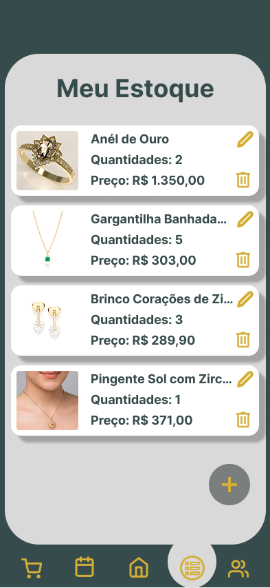
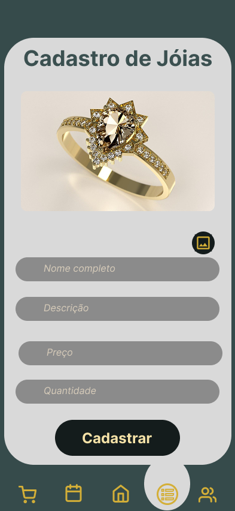

# Projeto de interface

Pré-requisitos: <a href="02-Especificacao.md"> Especificação do projeto</a>

Visão geral da interação do usuário pelas telas do sistema e protótipo interativo das telas com as funcionalidades que fazem parte do sistema (wireframes).

 Apresente as principais interfaces da plataforma. Discuta como ela foi elaborada de forma a atender os requisitos funcionais, não funcionais e histórias de usuário abordados na <a href="02-Especificacao.md"> Especificação do projeto</a>.
### Diagrama de fluxo

O diagrama apresenta o estudo do fluxo de interação do usuário com o sistema interativo, muitas vezes sem a necessidade de desenhar o design das telas da interface. Isso permite que o design das interações seja bem planejado e tenha impacto na qualidade do design do wireframe interativo que será desenvolvido logo em seguida.

O diagrama de fluxo pode ser desenvolvido com “boxes” que possuem, internamente, a indicação dos principais elementos de interface — tais como menus e acessos — e funcionalidades, como editar, pesquisar, filtrar e configurar, além da conexão entre esses boxes a partir do processo de interação.

> **Links úteis**:
> - [Como criar um diagrama de fluxo de usuário](https://www.lucidchart.com/blog/how-to-make-a-user-flow-diagram)
> - [Fluxograma online: seis sites para fazer gráfico sem instalar nada](https://www.techtudo.com.br/listas/2019/03/fluxograma-online-seis-sites-para-fazer-grafico-sem-instalar-nada.ghtml)

## Wireframes

## Interface do sistema

Visão geral da interação do usuário por meio das telas do sistema. Apresente as principais interfaces da plataforma em sua versão final.

### Telas de cadastros e login
Tela de Login ao sistema.

Tela de cadatro usuario

Tela cadastro cliente

### Tela principal do sistema

Descrição da tela principal do sistema.

> Insira aqui a tela principal do sistema

###  Telas do processo de Gerenciar cadastro de joias

Tela do estoque de joias. Através dela é possível visualizar, adicionar, editar e excluir joias.

Tela do cadastro de novas joias. Através dela é possível preencher os dados da nova joia e inserir no estoque.

Tela da edição de joia. Através dela é possível alterar as informações de uma joia existente e atualizar no estoque.

### Telas do processo 2

Descrição da tela relativa à atividade 1 do processo 2.

> Insira aqui a tela da atividade 1

Descrição da tela relativa à atividade 2 do processo 2.

> Insira aqui a tela da atividade 2
