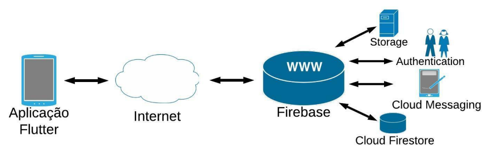
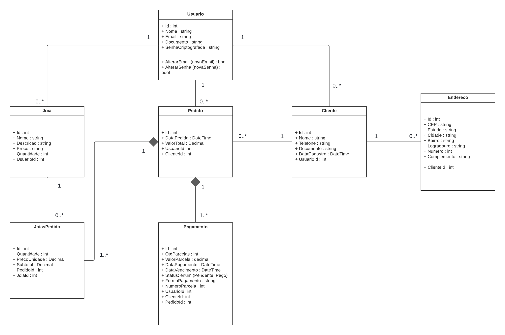

# Arquitetura da solução

<span style="color:red">Pré-requisitos: <a href="05-Projeto-interface.md"> Projeto de interface</a></span>

Definição de como o software é estruturado em termos dos componentes que fazem parte da solução e do ambiente de hospedagem da aplicação móvel.


Segue um exemplo da arquitetura com o uso do Flutter para o desenvolvimento da aplicação móvel:




## Diagrama de classes




##  Modelo de dados

O desenvolvimento da solução proposta requer a existência de bases de dados que permitam realizar o cadastro de dados e os controles associados aos processos identificados, assim como suas recuperações.

Utilizando a notação do DER (Diagrama Entidade-Relacionamento), elabore um modelo, usando alguma ferramenta, que contemple todas as entidades e atributos associados às atividades dos processos identificados. Deve ser gerado um único DER que suporte todos os processos escolhidos, visando, assim, uma base de dados integrada. O modelo deve contemplar também o controle de acesso dos usuários (partes interessadas nos processos) de acordo com os papéis definidos nos modelos do processo de negócio.

Apresente o modelo de dados por meio de um modelo relacional que contemple todos os conceitos e atributos apresentados na modelagem dos processos.

### Modelo ER

O Modelo ER representa, por meio de um diagrama, como as entidades (coisas, objetos) se relacionam entre si na aplicação interativa.

> **Links úteis**:
> - [Como fazer um diagrama entidade relacionamento](https://www.lucidchart.com/pages/pt/como-fazer-um-diagrama-entidade-relacionamento)

### Esquema relacional

O Esquema Relacional corresponde à representação dos dados em tabelas juntamente com as restrições de integridade e chave primária.
 


---

> **Links úteis**:
> - [Criando um modelo relacional - documentação da IBM](https://www.ibm.com/docs/pt-br/cognos-analytics/12.0.0?topic=designer-creating-relational-model)

### Modelo físico

```sql
CREATE TABLE usuarios (
	id INTEGER GENERATED BY DEFAULT AS IDENTITY PRIMARY KEY,
	nome VARCHAR(100) NOT NULL,
	email VARCHAR(100) NOT NULL UNIQUE,
	documento VARCHAR(18) NOT NULL UNIQUE,
	senhaCriptografada VARCHAR(100) NOT NULL
);

CREATE TABLE clientes ( 
	id INTEGER GENERATED BY DEFAULT AS IDENTITY PRIMARY KEY,
	nome VARCHAR(100) NOT NULL,
	documento VARCHAR(18) NOT NULL UNIQUE,
	telefone VARCHAR(15),
	dataCadastro TIMESTAMP NOT NULL DEFAULT NOW(),
	
	usuarioId INTEGER NOT NULL,

	CONSTRAINT fk_usuario FOREIGN KEY (usuarioId) REFERENCES usuarios(id)
);

CREATE TABLE enderecoClientes (
	id INTEGER GENERATED BY DEFAULT AS IDENTITY PRIMARY KEY,
	logradouro VARCHAR(180),
    numero VARCHAR(10),
    complemento VARCHAR(50),
    bairro VARCHAR(45),
	estado VARCHAR(45),
    cidade VARCHAR(45),
    cep VARCHAR(10),
	
	clienteId INTEGER NOT NULL,

	CONSTRAINT fk_cliente FOREIGN KEY (clienteId) REFERENCES clientes(id)

);

CREATE TABLE pedidos ( 
	id INTEGER GENERATED BY DEFAULT AS IDENTITY PRIMARY KEY,
	dataPedido TIMESTAMP NOT NULL DEFAULT NOW(),
	valorTotal NUMERIC(10,2) NOT NULL,
	
	usuarioId INTEGER NOT NULL,
	clienteId INTEGER NOT NULL,

	CONSTRAINT fk_usuario FOREIGN KEY (usuarioId) REFERENCES usuarios(id),
	CONSTRAINT fk_cliente FOREIGN KEY (clienteId) REFERENCES clientes(id)
);

CREATE TABLE joias ( 
	id INTEGER GENERATED BY DEFAULT AS IDENTITY PRIMARY KEY,
	nome VARCHAR(100) NOT NULL,
	descricao TEXT,
	preco NUMERIC(10,2) NOT NULL,
	quantidade INTEGER NOT NULL,
	
	usuarioId INTEGER NOT NULL,

	CONSTRAINT fk_usuario FOREIGN KEY (usuarioId) REFERENCES usuarios(id)
);

CREATE TABLE joiasPedidos ( 
	id INTEGER GENERATED BY DEFAULT AS IDENTITY PRIMARY KEY,
	quantidade INTEGER NOT NULL,
	precoUnidade NUMERIC(10,2) NOT NULL,
	subtotal NUMERIC(10,2) NOT NULL,

	pedidoId INTEGER NOT NULL,
	joiaId INTEGER NOT NULL,	

	CONSTRAINT fk_pedido FOREIGN KEY (pedidoId) REFERENCES pedidos(id),
	CONSTRAINT fk_joia FOREIGN KEY (joiaId) REFERENCES joias(id)
);

CREATE TABLE pagamentos ( 
	id INTEGER GENERATED BY DEFAULT AS IDENTITY PRIMARY KEY,
	numeroParcela INTEGER, NOT NULL,
	qtdParcelas INTEGER NOT NULL,
	valorParcela NUMERIC(10,2) NOT NULL,
	dataPagamento TIMESTAMP,
	dataVencimento TIMESTAMP NOT NULL,
	status VARCHAR(15),
	formaPagamento VARCHAR(15),

	usuarioId INTEGER NOT NULL,	
	pedidoId INTEGER NOT NULL,
	clienteId INTEGER NOT NULL,

	CONSTRAINT fk_usuario FOREIGN KEY (usuarioId) REFERENCES usuarios(id),
	CONSTRAINT fk_pedido FOREIGN KEY (pedidoId) REFERENCES pedidos(id),
	CONSTRAINT fk_cliente FOREIGN KEY (clienteId) REFERENCES clientes(id)
);

```
Esse script deverá ser incluído em um arquivo .sql na pasta [de scripts SQL](../src/db).


## Tecnologias

Descreva qual(is) tecnologias você vai usar para resolver o seu problema, ou seja, implementar a sua solução. Liste todas as tecnologias envolvidas, linguagens a serem utilizadas, serviços web, frameworks, bibliotecas, IDEs de desenvolvimento, e ferramentas.

Apresente também uma figura explicando como as tecnologias estão relacionadas ou como uma interação do usuário com o sistema vai ser conduzida, por onde ela passa até retornar uma resposta ao usuário.


| **Dimensão**   | **Tecnologia**  |
| ---            | ---             |
| Front-end      |  React-Native + Typescript |
| Back-end       | C#     |
| SGBD           | PostGreSql          |
| Deploy         | Vercel          |


## Hospedagem

Explique como a hospedagem e o lançamento da plataforma foram realizados.

> **Links úteis**:
> - [Website com GitHub Pages](https://pages.github.com/)
> - [Programação colaborativa com Repl.it](https://repl.it/)
> - [Getting started with Heroku](https://devcenter.heroku.com/start)
> - [Publicando seu site no Heroku](http://pythonclub.com.br/publicando-seu-hello-world-no-heroku.html)

## Qualidade de software

Conceituar qualidade é uma tarefa complexa, mas ela pode ser vista como um método gerencial que, por meio de procedimentos disseminados por toda a organização, busca garantir um produto final que satisfaça às expectativas dos stakeholders.

No contexto do desenvolvimento de software, qualidade pode ser entendida como um conjunto de características a serem atendidas, de modo que o produto de software atenda às necessidades de seus usuários. Entretanto, esse nível de satisfação nem sempre é alcançado de forma espontânea, devendo ser continuamente construído. Assim, a qualidade do produto depende fortemente do seu respectivo processo de desenvolvimento.

A norma internacional ISO/IEC 25010, que é uma atualização da ISO/IEC 9126, define oito características e 30 subcaracterísticas de qualidade para produtos de software. Com base nessas características e nas respectivas subcaracterísticas, identifique as subcaracterísticas que sua equipe utilizará como base para nortear o desenvolvimento do projeto de software, considerando alguns aspectos simples de qualidade. Justifique as subcaracterísticas escolhidas pelo time e elenque as métricas que permitirão à equipe avaliar os objetos de interesse.

> **Links úteis**:
> - [ISO/IEC 25010:2011 - Systems and Software Engineering — Systems and Software Quality Requirements and Evaluation (SQuaRE) — System and Software Quality Models](https://www.iso.org/standard/35733.html/)
> - [Análise sobre a ISO 9126 – NBR 13596](https://www.tiespecialistas.com.br/analise-sobre-iso-9126-nbr-13596/)
> - [Qualidade de software - Engenharia de Software](https://www.devmedia.com.br/qualidade-de-software-engenharia-de-software-29/18209)
