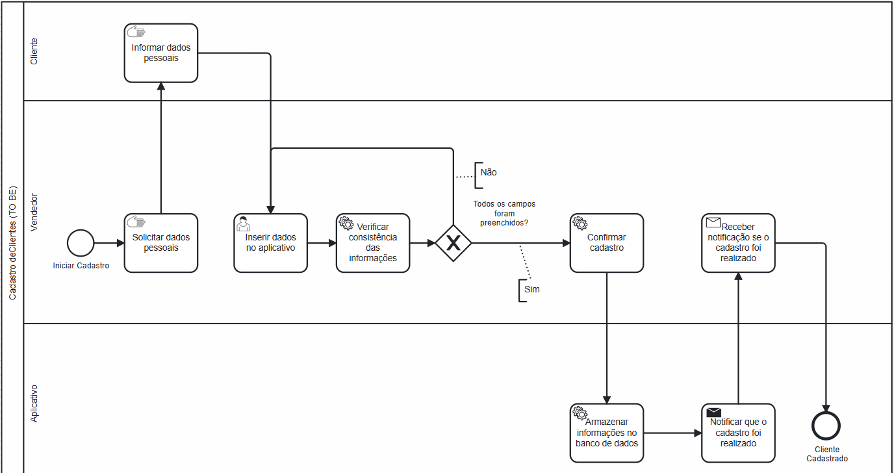

### 3.3.2 Processo 2 – Cadastro de Clientes
 
Atualmente, o processo de cadastro de clientes é feito de forma manual, utilizando anotações em papel, o que torna difícil manter a organização, recuperar informações e evitar erros ou esquecimentos. Esse método exige mais tempo, está sujeito a perdas físicas dos registros e não oferece nenhum tipo de automação ou controle. A proposta “to be” apresenta uma solução digital por meio de um aplicativo, com campos bem definidos. Essa transição representa uma melhoria significativa, trazendo mais agilidade, precisão e segurança para o registro e gerenciamento de clientes, especialmente considerando o perfil da nossa cliente, que busca por praticidade em uma ferramenta para utilizar.

#### As Is

#### To Be
 

#### Detalhamento das atividades

O processo se inicia com o usuário solicitando os dados pessoais do cliente. Após receber as informações, elas são inseridas na tela de cadastro do aplicativo. O aplicativo verifica a consistência dos dados, checando se todos os campos foram preenchidos e se não há um cadastro duplicado por meio do documento (CPF/CNPJ). Estando tudo correto, o aplicativo solicita a confirmação do cadastro e, após a confirmação, as informações são armazenadas no banco de dados. O usuário então recebe uma notificação de que o cliente foi cadastrado, e o processo é finalizado.

_Os tipos de dados a serem utilizados são:_

_* **Caixa de texto** - campo texto de uma linha_

_* **Número** - campo numérico_

_* **Data e Hora** - campo do tipo data e hora (dd-mm-aaaa, hh:mm:ss)_

_* **Seleção única** - campo com várias opções de valores que são mutuamente exclusivas (tradicional radio button)_

_* **Arquivo** - campo de upload de documento_

**Inserir dados no aplicativo**

| **Campo**       | **Tipo**         | **Restrições** | **Valor default** |
| ---             | ---              | ---            | ---               |
| Nome Completo   | Caixa de Texto   | not null       |                   |
| Documento       | Caixa de Texto   | not null, unique|                  |
| Número Telefone | Caixa de Texto   | not null        |                |
| CEP             | Caixa de Texto   |                 |                  |
| Cidade          | Caixa de Texto   |                 |                  |
| Bairro          | Caixa de Texto   |                 |                  |
| Rúa             | Caixa de Texto   |                 |                  |
| Número          | Caixa de Texto   |                 |                  |

| **Comandos**         |  **Destino**                   | **Tipo** |
| ---                  | ---                            | ---               |
| Cadastrar            | Confirmar Cadastro             |                   |

**Nome da atividade 2**

| **Campo**       | **Tipo**         | **Restrições** | **Valor default** |
| ---             | ---              | ---            | ---               |
| [Nome do campo] | [tipo de dados]  |                |                   |
|                 |                  |                |                   |

| **Comandos**         |  **Destino**                   | **Tipo**          |
| ---                  | ---                            | ---               |
| [Nome do botão/link] | Atividade/processo de destino  | (default/cancel/  ) |
|                      |                                |                   |
