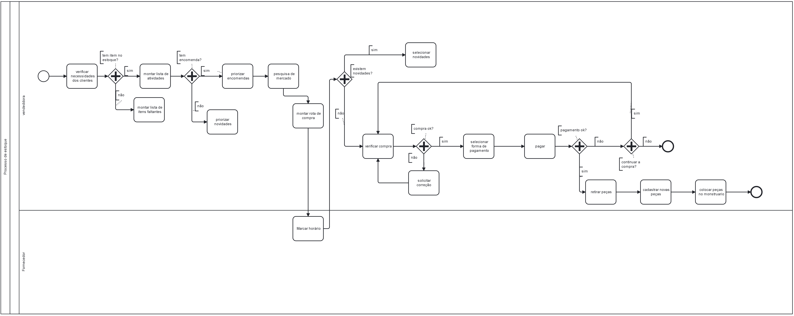

### 3.3.1 Processo 3 – Controle de estoque
O processo tem como objetivo o controle de estoque, representando desde motivação da escolha de peças, até o processo de compra e cadastro de novos produtos.
 #### As is

#### To Be

#### Detalhamento das atividades

O processo se inicia com a criação de listas de necessidades, contendo itens como peças faltantes e encomendas a serem buscadas no fornecedor. Após a inclusão dos itens na lista, a vendedora irá até o fornecedor, selecionará as peças e realizará o pagamento. Em seguida, as novas peças serão cadastradas no sistema, e o aplicativo armazenará todas as informações no banco de dados.

**Emitir lista de necessidades**

| **Campo**       | **Tipo**         | **Restrições** | **Valor default** |
| ---             | ---              | ---            | ---               |
| idItem         | inteiro  | not null               |                   |
| nomeItem  | Caixa de Texto        not null          |                |                   |
| nomeDaCliente           | Caixa de Texto   | not null |                |

| **Comandos**         |  **Destino**                   | **Tipo** |
| ---                  | ---                            | ---               |
| [Verificar Anotações/link] | Emite lista de peças necessárias  | (default/cancel/  ) |

**Cadastrar peças**

| **Campo**       | **Tipo**         | **Restrições** | **Valor default** |
| ---             | ---              | ---            | ---               |
| idItem | int  |                |   not null                |
| nomeItem                |   Caixa de Texto                 |  not null              |                   |
| TipoItem                     |  Caixa de Texto                                  |  not null                 |
| DescricaoItem               |    Caixa de Texto                                  |  not null                 |

| **Comandos**         |  **Destino**                   | **Tipo**          |
| ---                  | ---                            | ---               |
| [Cadastrar Item] | Confirmar Cadastro  | (default/cancel/  ) |
|                      |                                |                   |
